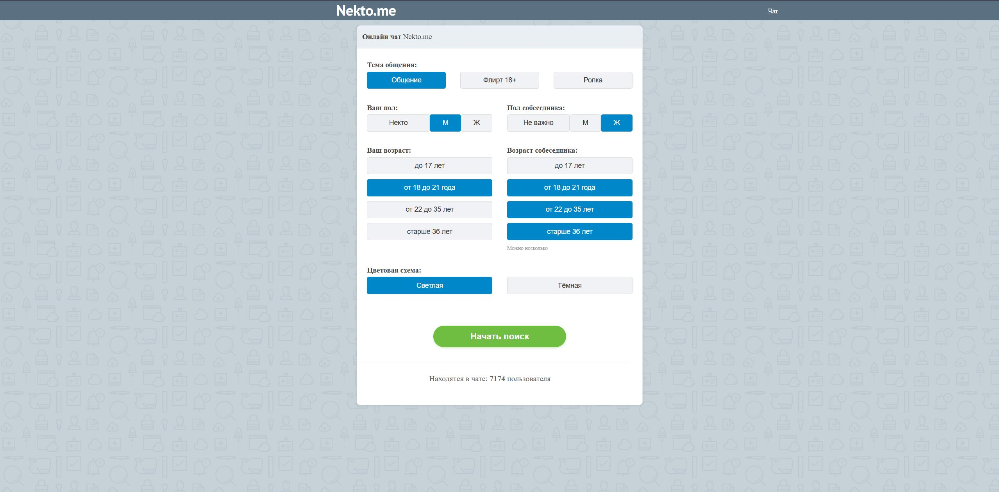
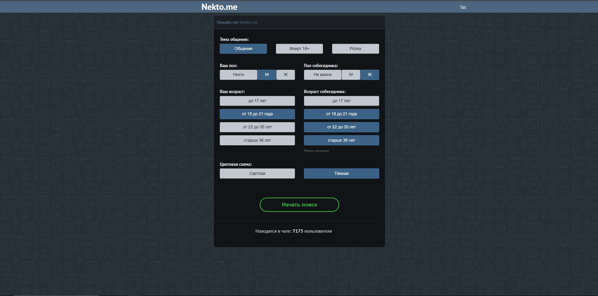

# Nektome

> Анонимный чат с AI-собеседниками. Глубокая генерация персонажей + реалистичный чат-интерфейс.

## Описание

Nektome — это веб-приложение для анонимного общения с AI-собеседниками. Каждый персонаж генерируется с уникальной внешностью, биографией, типом личности, стилем общения и манерой письма. Чат-интерфейс имитирует реальный анонимный чат с индикатором печати, online-счётчиком и RP-режимом.

## Установка

### Требования
- Python 3.10 или выше
- pip (менеджер пакетов Python)

### Установка зависимостей

```bash
# Клонируйте репозиторий
git clone https://github.com/StandarterDF/Nektome
cd Nektome

# Создайте виртуальное окружение
python -m venv venv

# Активируйте (Windows)
.\venv\Scripts\activate

# Активируйте (Linux/macOS)
source venv/bin/activate

# Установите зависимости
pip install -r requirements.txt
```

### Настройка

Скопируйте `.env.example` в `.env` и укажите свои параметры:

```bash
cp .env.example .env
```

Минимальная конфигурация:
```
OPENAI_BASE_URL=https://api.deepseek.com/v1
OPENAI_API_KEY=sk-your-api-key-here
OPENAI_MODEL=deepseek-v4-flash
```

### Запуск

```bash
python app.py
```

Сервер запускается на **http://127.0.0.1:5000**.

## Использование

1. Откройте браузер на `http://127.0.0.1:5000`
2. Настройте фильтры поиска (пол, возраст, темы)
3. Нажмите «Начать поиск»
4. Дождитесь подключения собеседника
5. Общайтесь в чате

### Agent Mode

При включении `AGENT_ENABLED=true` AI может:
- Писать несколько сообщений подряд (с задержками как живой человек)
- Отключаться и переподключаться через случайное время
- Использовать инструменты: `send_message` и `disconnect`

Настройка в `.env`:
```
AGENT_ENABLED=true
AGENT_MAX_CONSECUTIVE=3
AGENT_IDLE_TIMEOUT=180
AGENT_RECONNECT_DELAY=60
```

## Web UI

| Светлая тема | Тёмная тема |
|---|---|
|  |  |

## API Routes

| Метод | Путь | Описание |
|---|---|---|
| `GET` | `/` | Web UI |
| `POST` | `/api/generate` | Сгенерировать персонажа |
| `POST` | `/api/chat` | Отправить сообщение |
| `GET` | `/api/online` | Количество людей онлайн |
| `POST` | `/api/agent/poll` | Polling для agent mode |

## Генерация персонажа

7-уровневая архитектура генерации:

1. **Архетип + темперамент** — базовая структура личности (Юнг + Гиппократ)
2. **Внешность** — рост, телосложение, красота, цвет глаз/волос, стиль
3. **Биография** — травма, ключевые события, убеждения
4. **Spice-блоки** — 3-5 случайных деталей из 17 пулов
5. **Профиль** — профессия, хобби, предпочтения, цели в чате
6. **Стиль общения** — манера письма, открытость, юмор, RP-способность
7. **Контекст** — настроение, ситуация, скрытый мотив, opener

## Конфигурация

Задаётся через `.env`:

| Переменная | По умолчанию | Описание |
|---|---|---|
| `OPENAI_BASE_URL` | `https://api.deepseek.com/v1` | OpenAI-совместимый эндпоинт |
| `OPENAI_API_KEY` | — | API-ключ |
| `OPENAI_MODEL` | `deepseek-v4-flash` | Название модели |
| `AGENT_ENABLED` | `false` | Включить agent mode |
| `AGENT_MAX_CONSECUTIVE` | `3` | Макс. сообщений подряд |
| `AGENT_IDLE_TIMEOUT` | `180` | Таймаут бездействия (сек) |
| `AGENT_RECONNECT_DELAY` | `60` | Задержка перед переподключением (сек) |

## Зависимости

```
flask
python-dotenv
```

## Лицензия

MIT